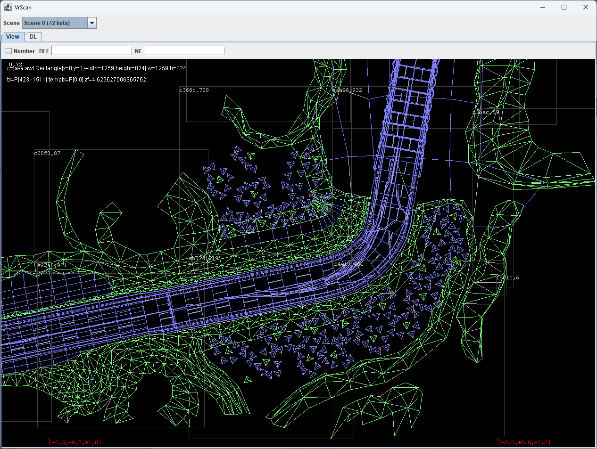

# vrscan

experiments to scan the sega model 1 arcade game roms for 3d geometry

the best supported game is virtua racing arcade (sega, 1992)

the roms themselves are not part of this project, and this project is not associated with sega

entry points:
 
* vr.ui.ScanJF - Swing UI to display polygon rom data in 3d
* vr.ui.BinJF - Swing UI to display any rom contents as a 2d image

todo: everything

references:

- https://github.com/mamedev/mame/blob/master/src/mame/sega/model1.cpp (and others)
- https://en.wikipedia.org/wiki/Virtua_Racing
- https://www.segaretro.org/Sega_Model_1
- https://tcrf.net/Category:Virtua_Racing_series
- https://freds72.itch.io/virtua-racing/devlog/100269/from-bytes-to-3d

